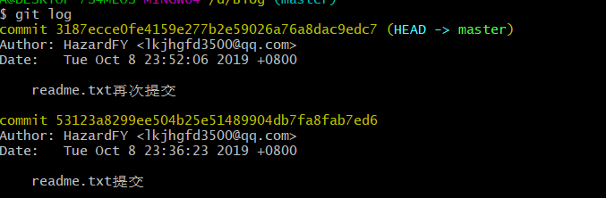
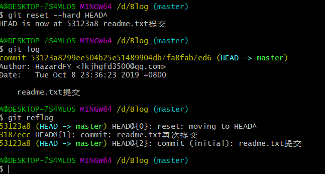

# Git使用

----------------------

参考文章;https://www.cnblogs.com/smuxiaolei/p/7484678.html

### 初始化设置

git config --global user.name "HzardFY"

git config --global user.email  "lkjhgfd3500@qq.com"

### 初始化仓库

git init

### 文件提交

* 暂存到缓存区

  ~~~
  git add readme.txt
  git add .   #提交所有文件
  ~~~

* 提交，并加上提交的注释

  ~~~
  git commit -m "readme.txt提交"
  ~~~

* 查看是否还有文件未提交

  ~~~
  git status
  ~~~

* 查看缓存区中文件修改的不同

  ~~~
  git diff readme.txt
  ~~~

  

### 版本回退

* 使用git log查看提交文件的提交的记录

  

  如果感觉显示内容过多可以使用git log -pretty=online

  现在我想使用版本回退操作，我想把当前的版本回退到上一个版本，要使用什么命令呢？可以使用如下2种命令，第一种是：git reset  --hard HEAD^ 那么如果要回退到上上个版本只需把HEAD^ 改成 HEAD^^ 以此类推。那如果要回退到前100个版本的话，使用上面的方法肯定不方便，我们可以使用下面的简便命令操作：git reset  --hard HEAD~100 

* 想回到最新的版本

  原先的查看版本的命令无法查看最新的版本位置

  ~~~
  git reflog
  ~~~

  

  查到版本号：git reset --hard 3187ecc

### 撤销修改

* ~~~
  git checkout -- readme.txt
  ~~~

  命令 git checkout --readme.txt 意思就是，把readme.txt文件在工作区做的修改全部撤销，这里有2种情况，如下：

  1. readme.txt自动修改后，还没有放到暂存区，使用 撤销修改就回到和版本库一模一样的状态。
  2. 另外一种是readme.txt已经放入暂存区了，接着又作了修改，撤销修改就回到添加暂存区后的状态。

### 删除文件

* ~~~
  rm b.txt
  ~~~

  在工作区删除文件，还需要commit提交操作

  只要没有commit之前，可以通过恢复文件

  ~~~
  git checkout -- b.txt
  ~~~

### 远程仓库

1. 创建SSH Key，在主目录下看看有没有.ssh目录

   没有的话输入   ，获得私钥和公钥id_rsa.pub，将公钥粘贴到GitHub账号设置中的SSH Keys中

   ~~~
   ssh-keygen  -t rsa –C “youremail@example.com”
   ~~~

2. 将本地仓库内容推送至Github

    ~~~
git remote add origin https://github.com/tugenhua0707/testgit.git
    
    git push -u origin master#第一次传送
    Git不但会把本地的master分支内容推送的远程新的master分支，
    还会把本地的master分支和远程的master分支关联起来，在以后的推送或者拉取时就可以简化命令。
    git push origin master
    ~~~

3. 将远程仓库内容下载到本地

   ~~~
   git clone "..."
   ~~~

   git pull命令作用：取回远程主机某个分支的更新，再与本地的指定分支合并

   git pull = git fetch + git merge

   ```
   git pull <远程主机名> <远程分支名>:<本地分支名>
   git pull origin master:brantest
   将远程主机origin的master分支拉取过来，与本地的brantest分支合并。
   后面的冒号可以省略：
   git pull origin master
   ```

   用fetch命令：

   ```
   git fetch origin master:brantest
   git merge brantest
   ```

   相比起来git fetch更安全一些，因为在merge前，我们可以查看更新情况，然后再决定是否合并。

### 创建和合并分支

~~~
　　查看分支：git branch

　　创建分支：git branch name

　　切换分支：git checkout name

　　创建+切换分支：git checkout –b name

　　合并某分支到当前分支：git merge name

　　删除分支：git branch –d name
~~~

